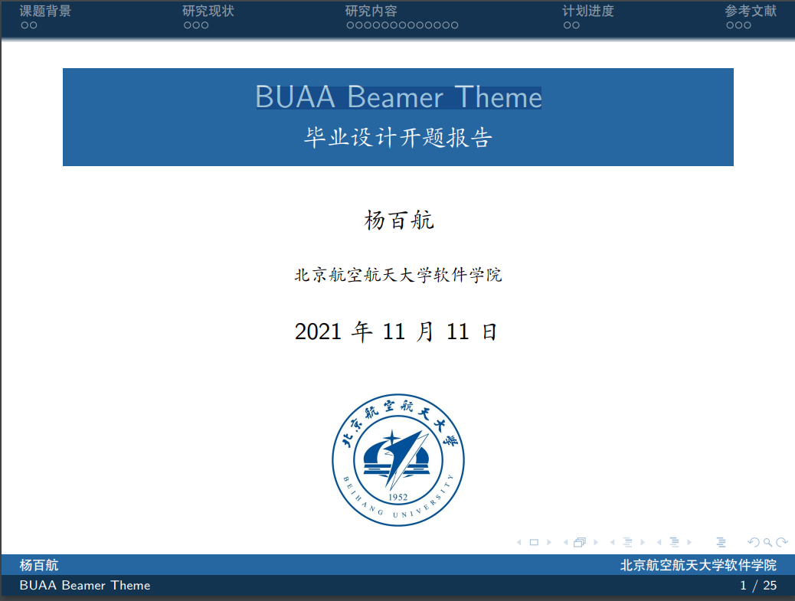
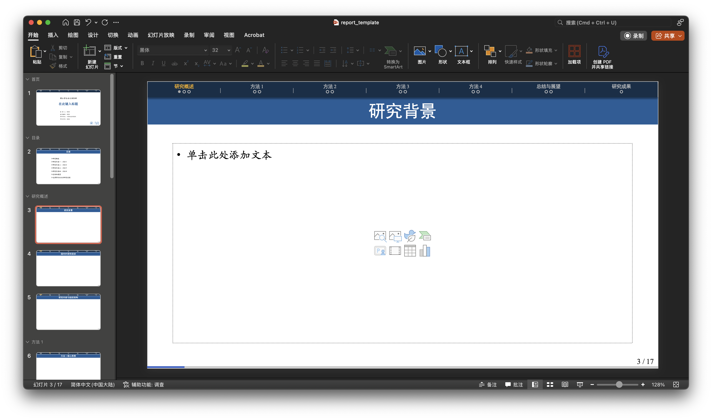

# 学术报告 PPT 模板：取 Beamer 之精华，补 PowerPoint 之糟粕

## Modified from ZhouKanglei/BUAA-PPT

## LaTeX Beamer 格式的优点和缺点

以 [BUAA Beamer Theme](https://www.overleaf.com/latex/templates/buaa-beamer-theme/sqsnwgkbxvtx) 为例，LaTeX 中 Beamer 格式的优点包括：
 

- 目录栏：可以在任意一页中快速定位各章节标题
  
- 导航按钮：可以 PPT 或者在生成的 PDF 中的任意一页快速定位
  
- 页码总数：便于查看演示进度
  
- 进度条：便于查看演示进度
  

这些优点使得演示文稿结构清晰，易于跟踪。然而，Beamer 格式也有一些缺点，例如：
- 动画、排版的复杂性

## 利用 VBA 实现进度条、总页码添加、目录栏、导航按钮等功能

PowerPoint 并没有提供自动化实现上述功能的方法，为了克服这些缺点，我们可以借助 PPT 的 VBA 实现上述功能。

这种方法特别适用于需要在 PowerPoint 中实现类似 LaTeX Beamer 样式的演示文稿。通过 VBA 脚本，可以自动添加进度条、总页码、目录栏和导航按钮等功能，使得演示文稿更加专业和易于导航。这对于学术报告、教学演示以及需要清晰结构和进度指示的任何演示文稿都非常有用。

当我们完成 PPT 主要内容的设置后，通过以下步骤自动化实现上述功能：
- 首先设置章节标题，这些标题将会显示在顶部标题栏
- 然后运行 `ppt.vba` 中的代码
  
1. **打开开发者工具**：
    - 打开 PowerPoint，点击“文件”菜单，选择“选项”。
    - 在 PowerPoint 选项窗口中，选择“自定义功能区”。
    - 在右侧的主选项卡列表中，勾选“开发工具”选项，然后点击“确定”。

2. **打开 VBA 编辑器**：
    - 在 PowerPoint 界面中，点击“开发工具”选项卡。
    - 点击“Visual Basic”按钮，打开 VBA 编辑器。

3. **插入模块**：
    - 在 VBA 编辑器中，点击“插入”菜单，选择“模块”。
    - 这将在项目资源管理器中创建一个新的模块。

4. **粘贴 VBA 代码**：
    - 将 `ppt.vba` 文件中的代码复制并粘贴到新创建的模块中。

5. **运行 VBA 代码**：
    - 在 VBA 编辑器中，点击“运行”菜单，选择“运行子过程/用户窗体”。
    - 或者按下快捷键 `F5` 运行代码。

6. **保存和关闭**：
    - 运行完代码后，保存并关闭 VBA 编辑器。
    - 返回 PowerPoint，检查是否成功添加了进度条、总页码、目录栏和导航按钮等功能。

通过以上步骤，您可以在 PowerPoint 中运行 VBA 脚本，实现类似 LaTeX Beamer 样式的演示文稿功能。

## 推广性

通过修改 PPT 中的 LOGO 和 VBA 代码，就可以定制属于自己的专属文档模板了！
